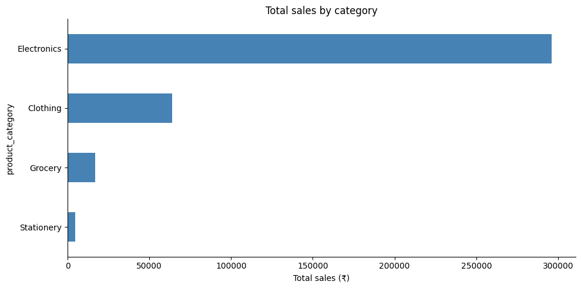
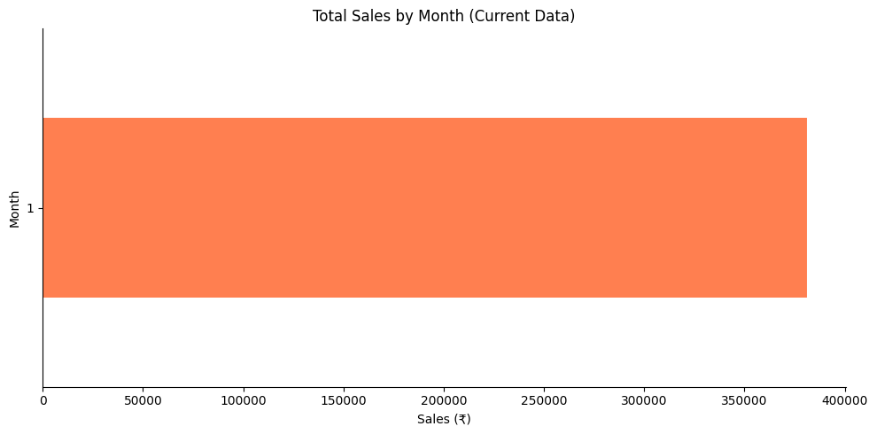
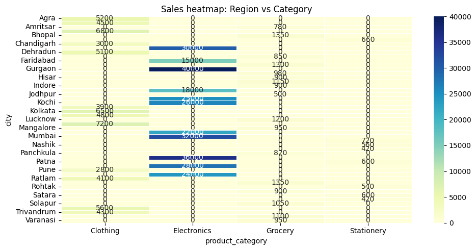

# Retail Sales Analysis — Python
End-to-end analysis of India retail sales data using
Python, Pandas, NumPy, Matplotlib and Seaborn.

## Tools used
Python · Pandas · NumPy · Matplotlib · Seaborn · Google Colab

## Dataset
- Source: Kaggle (India retail transactions)
- Records: 1,000+ rows across 4 regions, 5 categories

## Key findings
1. **[Top category]** drove X% of total revenue
2. **[Top city]** had the highest sales at ₹X
3. **Peak month** was [month] — X% above average
4. **UPI** was the most popular payment method (X% of orders)
5. **Mall stores** generated highest revenue vs other store types

## Charts

1. Open `retail_sales_analysis.ipynb` in Google Colab
2. Upload `retail_sales.csv` when prompted
3. Run all cells — charts save automatically
Click "Commit changes" when don
